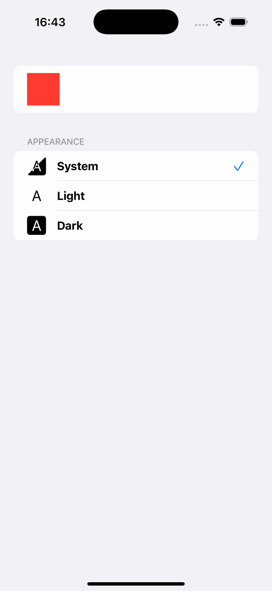

# 🎨 SwiftUI Themeing

Minimal reference for implementing light/dark theme switching using native SwiftUI features like AppStorage and Environment.

# Examples

See https://github.com/crisfeim/app-Movies for a concrete example of applying this
